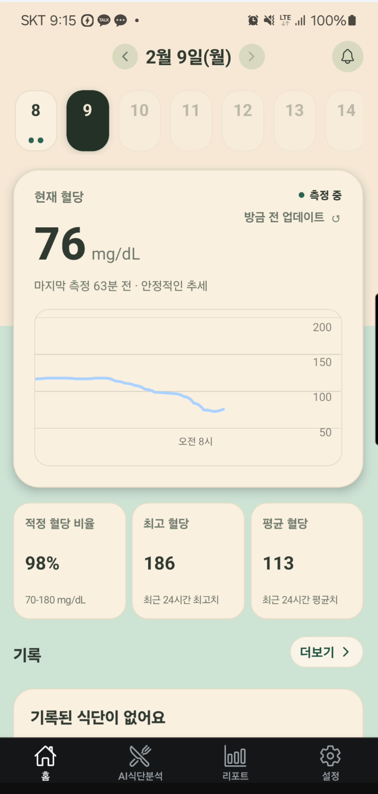
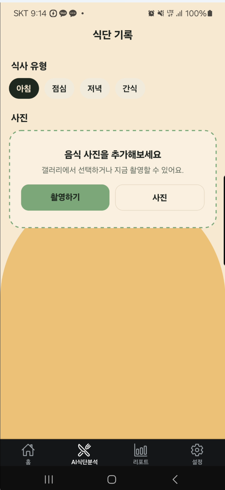
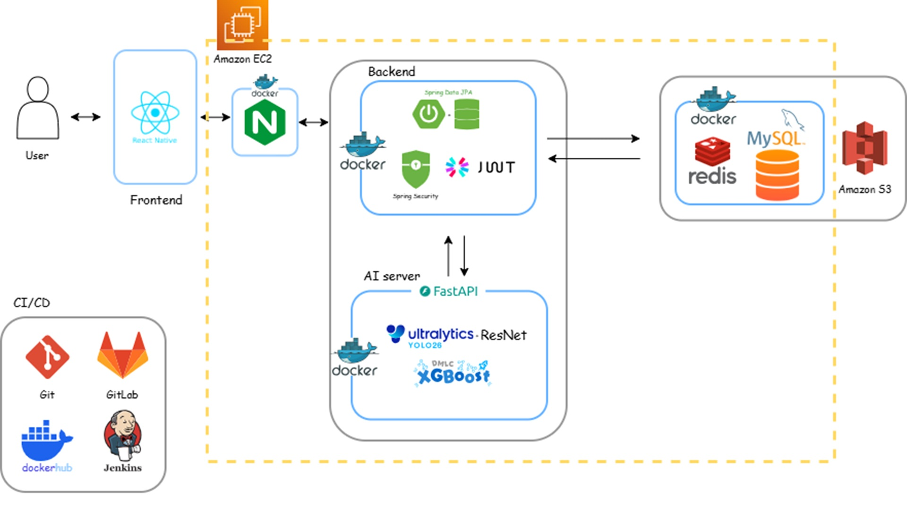

# 🫘 당낭콩 (DangNangKong) - 맞춤형 당뇨 및 혈당 관리 서비스

본 문서는 사용자의 식단 기록 및 식후 혈당 변화를 예측하여 체계적인 건강 관리를 지원하는 '당낭콩' 프로젝트의 통합 소개서입니다.

---

## 📅 1. 프로젝트 기간
* **개발 기간:** 2026.01.12 ~ 2026.02.13

---

## 💡 2. 프로젝트 개요
당뇨 위험군 및 제2형 당뇨병 환자에게 식단과 혈당 관리는 필수적이지만, 이를 매번 수기로 기록하고 예측하는 것은 상당한 번거로움을 동반합니다. 
'당낭콩'은 사용자가 섭취한 음식의 사진을 업로드하면 AI 모델이 이를 분석하여 영양 성분을 추출하고, 사용자의 연속혈당측정기(CGM) 데이터를 기반으로 식후 2시간 동안의 혈당 변화를 예측하는 스마트 헬스케어 솔루션입니다. 이를 통해 사용자는 직관적이고 과학적인 방식으로 혈당 스파이크를 예방하고 식습관을 개선할 수 있습니다.

---

## ✨ 3. 기능 소개

### 📸 1) Vision AI 기반 음식 인식 및 중량 추정
* **객체 인식 (YOLO26 모델):** AI Hub의 400종 음식 데이터를 학습시킨 모델을 활용하여 이미지 내 객체를 분류합니다. 특히 모바일 환경에 최적화된 추론 성능을 확보하여 평균 106ms의 신속한 응답 속도를 제공합니다.
* **중량 추정 (ResNet18 모델):** 인식된 음식의 분량을 5단계(Q1~Q5)로 세분화하여 분석합니다. 음식의 종류별 기준 중량에 해당 비율을 곱하여 실제 섭취량을 정밀하게 산출합니다.

### 🧮 2) 영양 성분 추출 및 탄수화물 계산
* AI 분석 결과를 자체 구축한 영양성분 데이터베이스와 대조하여, 사용자가 실제 섭취한 탄수화물 중량을 계산합니다. 산출된 데이터는 혈당 예측 모델의 핵심 입력(Input) 변수로 활용됩니다.

### 📈 3) 사용자 맞춤형 식후 혈당 예측 (시계열 회귀 모델)
* **초기 사용자 (데이터 수집 4일 미만):** 의학 논문에 기반한 수학적 모델링을 적용하여, 포도당 흡수 속도 및 인슐린 작용 지연 시간 등을 고려해 혈당을 예측합니다.
* **기존 사용자 (데이터 수집 4일 이상):** 축적된 데이터를 바탕으로 XGBoost 머신러닝 회귀 모델을 적용합니다. 식후 120분 동안의 혈당 추이를 5분 단위로 분할하여 24개의 독립적인 포인트를 예측하며, 개인화된 정밀 분석을 제공합니다.

---

## 🖼️ 4. 실제 구현 사진
본 프로젝트의 실제 구동 화면입니다.

* **📊 메인 대시보드:** 실시간 연속혈당측정기(CGM) 데이터 연동, 당일 칼로리 섭취 현황 및 AI 식후 혈당 예측 추이를 직관적으로 표시합니다.
    
* **🖊️ 식단 및 기록 등록:** 음식 사진(AI 인식 결과) 기반 식단 등록 및 주관적 증상, 운동 기록 등을 간편하게 입력하는 인터페이스입니다.
    
* **📜 히스토리 타임라인:** 과거 혈당 추이와 기록된 이벤트(식사, 운동 등)를 타임라인 형태로 종합하여 조회합니다.
    
* **📑 통계 리포트:** 기간별 혈당 관리 지표(목표 범위 내 비율, 평균 혈당 등)를 분석하여 시각화된 리포트를 제공합니다.
    

---

## 🗄️ 5. ERD (Entity Relationship Diagram)
데이터베이스의 전반적인 구조와 관계도입니다.

* **주요 테이블:** 사용자 기본 정보를 관리하는 `users` 테이블과 연속혈당측정기(CGM) 데이터를 시계열로 저장하는 `glucose_data` 테이블을 중심으로 설계되었습니다.

---

## 🏗️ 6. 시스템 아키텍처
당낭콩 서비스의 전체적인 시스템 흐름과 아키텍처 구조입니다.



* **Backend:** Java 17, Spring Boot
* **AI Server:** Python, FastAPI, Docker 환경 내 모델 서빙
* **Frontend:** React Native (Android APK 배포)
* **외부 API 및 인프라 연동:**
  * **Authentication:** Google, Kakao, Naver OAuth 2.0 소셜 로그인
  * **Healthcare Device:** Dexcom, CareSense CGM 데이터 연동
  * **Cloud & AI:** AWS S3 (이미지 스토리지), Google Gemini API 연동

---

## ⚙️ 7. 구동 방법 및 기타 사항
본 프로젝트의 상세한 설치 및 배포 과정은 아래의 가이드 문서를 참조해 주시기 바랍니다.

```bash
# Repository Clone
git clone [https://github.com/YeongRokSon/SSAFY_DangNangKong.git](https://github.com/YeongRokSon/SSAFY_DangNangKong.git)